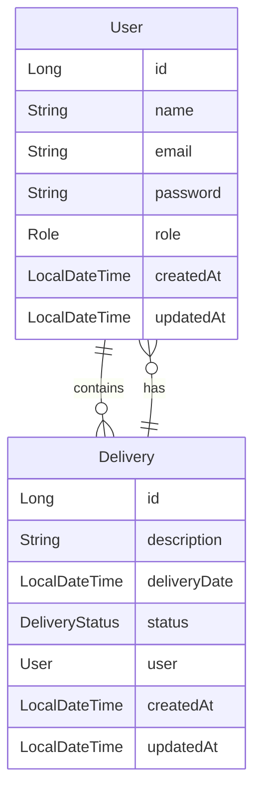

```mermaid
erDiagram
    User {
        Long id
        String name
        String email
        String password
        Role role
        LocalDateTime createdAt
        LocalDateTime updatedAt
    }
    Delivery {
        Long id
        String description
        LocalDateTime deliveryDate
        DeliveryStatus status
        User user
        LocalDateTime createdAt
        LocalDateTime updatedAt
    }
    User ||--o{ Delivery : "contains"
    Delivery ||--o{ User : "has"
```