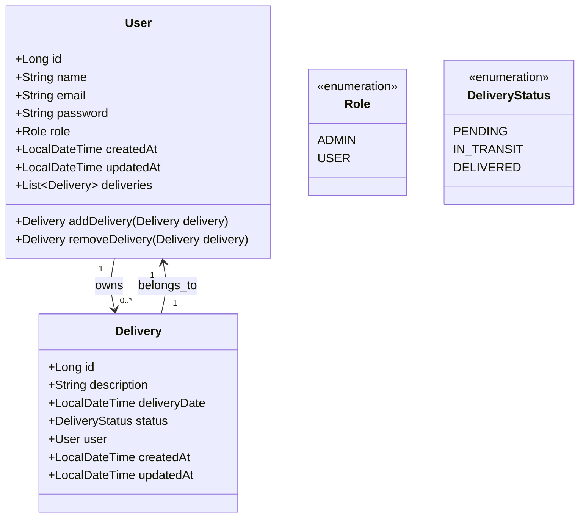

```mermaid
classDiagram
class User {
+Long id
+String name
+String email
+String password
+Role role
+LocalDateTime createdAt
+LocalDateTime updatedAt
+List~Delivery~ deliveries
+Delivery addDelivery(Delivery delivery)
+Delivery removeDelivery(Delivery delivery)
}

class Delivery {
    +Long id
    +String description
    +LocalDateTime deliveryDate
    +DeliveryStatus status
    +User user
    +LocalDateTime createdAt
    +LocalDateTime updatedAt
}

class Role {
    <<enumeration>>
    ADMIN
    USER
}

class DeliveryStatus {
    <<enumeration>>
    PENDING
    IN_TRANSIT
    DELIVERED
}

User "1" --> "0..*" Delivery : owns
Delivery "1" --> "1" User : belongs_to
```