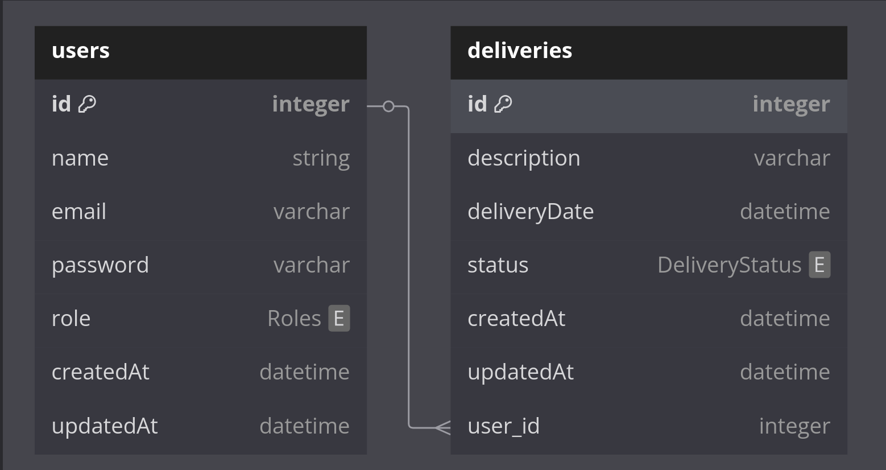

# :truck: Desafio Técnico Backend Spring Boot - Frete Mais

## 📃 Descrição
Este projeto é uma aplicação de gerenciamento de Entregas e Usuários, onde é possível cadastrar, listar, atualizar e deletar Entregas e Usuários.

## Diagrama de Entidade Relacionamento (DER)



## 🔎 Documentação Api - Swagger

A documentação da API pode ser acessada através do Swagger, que é uma ferramenta de software usada 
para documentar e consumir serviços da Web RESTful. Para acessar a documentação, basta acessar o link abaixo:

[Documentação API](http://localhost:8080/swagger-ui.html)

OBS: A documentação só estará disponível após a aplicação ser iniciada.

## 🛠️ Funcionalidades
<details>
    <summary>
        Resumo das funcionalidades disponíveis na API. Clique para expandir.
    </summary>


### Autenticação
- **Login**: Autentica um usuário e retorna um token JWT.
  - **Endpoint**: `POST /auth/login`
  - **Request Body**: `LoginDto` (email, password)
  - **Response**: `TokenDto` (token)

### Entregas
- **Listar Entregas**: Retorna uma lista de todas as entregas.
    - **Endpoint**: `GET /deliveries`
    - **Response**: Lista de `DeliveryDto`
    - **Requer Autenticação**: Sim(`ADMIN` | `USER`)

- **Buscar Entrega por ID**: Retorna uma entrega específica pelo ID.
    - **Endpoint**: `GET /deliveries/{id}`
    - **Response**: `DeliveryDto`
    - **Requer Autenticação**: Sim(`ADMIN` | `USER`)

- **Criar Entrega**: Cria uma nova entrega.
    - **Endpoint**: `POST /deliveries`
    - **Request Body**: `DeliveryCreationDto`
    - **Response**: `DeliveryDto`
    - **Requer Autenticação**: Sim (`ADMIN`)

- **Atualizar Entrega**: Atualiza uma entrega existente.
    - **Endpoint**: `PUT /deliveries/{id}`
    - **Request Body**: `DeliveryUpdateDto`
    - **Response**: `DeliveryDto`
    - **Requer Autenticação**: Sim (`ADMIN`)

- **Atualizar Status da Entrega**: Atualiza o status de uma entrega.
    - **Endpoint**: `PUT /deliveries/{id}/status`
    - **Request Body**: `DeliveryUpdateStatusDto`
    - **Response**: `DeliveryDto`
    - **Requer Autenticação**: Sim(`ADMIN` | `USER`)

- **Deletar Entrega**: Deleta uma entrega pelo ID.
    - **Endpoint**: `DELETE /deliveries/{id}`
    - **Requer Autenticação**: Sim (`ADMIN`)

### Usuários
- **Listar Usuários**: Retorna uma lista de todos os usuários.
    - **Endpoint**: `GET /users`
    - **Response**: Lista de `UserAdminResponseDto`
    - **Requer Autenticação**: Sim (`ADMIN`)

- **Buscar Usuário por ID**: Retorna um usuário específico pelo ID.
    - **Endpoint**: `GET /users/{id}`
    - **Response**: `UserDto`
    - **Requer Autenticação**: Sim(`ADMIN` | `USER`)

- **Criar Usuário**: Cria um novo usuário.
    - **Endpoint**: `POST /users`
    - **Request Body**: `UserCreationDto`
    - **Response**: `UserDto`

- **Atualizar Usuário**: Atualiza um usuário existente.
    - **Endpoint**: `PUT /users/{id}`
    - **Request Body**: `UserUpdateDto`
    - **Response**: `UserDto`
    - **Requer Autenticação**: Sim(`ADMIN` | `USER`)

- **Adicionar Entrega ao Usuário**: Adiciona uma entrega a um usuário.
    - **Endpoint**: `POST /users/{id}/delivery/{deliveryId}`
    - **Response**: `UserDeliveryListDto`
    - **Requer Autenticação**: Sim (`ADMIN`)

- **Deletar Usuário**: Deleta um usuário pelo ID.
    - **Endpoint**: `DELETE /users/{id}`
    - **Requer Autenticação**: Sim (`ADMIN`)


</details>

## ⚙️ Como rodar o projeto

### 🔧 Pré-requisitos
- **Java**: Versão 17
- **Maven**: Versão 3.8.1 ou superior
- **Docker**: Versão 20.10.0 ou superior
- **Docker Compose**: Versão 1.27.0 ou superior

### Usando Docker Compose para criar container do MySQL

1. Clone o repositório:
    ```sh
    git clone <URL_DO_REPOSITORIO>
    ```
2. Navegue até o diretório do projeto:
    ```sh
    cd <DIRETORIO_DO_PROJETO>
    ```
3. Rode o Docker Compose:
    ```sh
    docker-compose up -d
    ```

### Usando Maven
1. Clone o repositório:
   ```sh
   git clone <URL_DO_REPOSITORIO>
    ```
2. Navegue até o diretório do projeto:
   ```sh
    cd <DIRETORIO_DO_PROJETO>
    ```
3. Compile e rode o projeto usando Maven:
    ```sh
    mvn spring-boot:run
    ```

## 📦 Dependências utilizadas
- Spring Boot Starter Web
- Spring Boot Starter Data JPA
- MySQL Connector/J
- Spring Boot DevTools
- Spring Boot Starter Actuator
- Java JWT
- Spring Boot Starter Security
- Spring Security Test
- Spring Boot Starter
- Spring Boot Starter Test
- H2 Database
- JUnit Jupiter

## 👤 Autor

- [@Murilo-MRS](https://github.com/Murilo-MRS)
